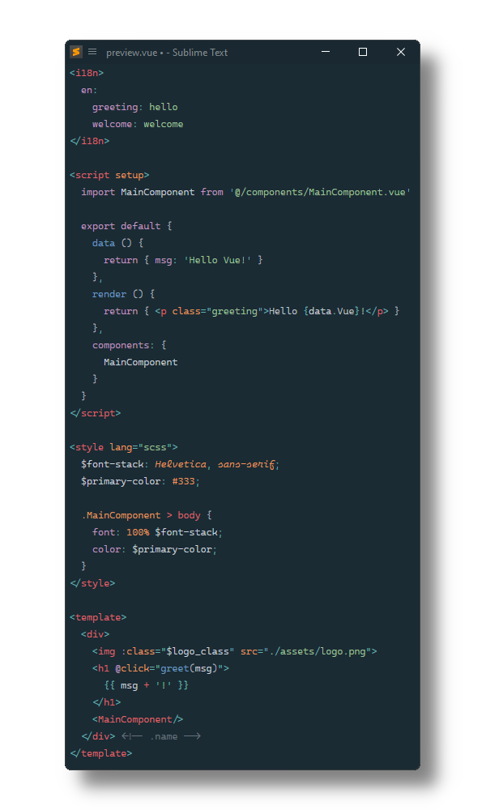

# Vue

Sublime Text Syntax highlighting for single-file [Vue.js](http://vuejs.org) components 
based on its HTML, CSS, JavaScript, TypeScript, JSX, TSX and HAML syntaxes.

The `main` branch targets Sublime Text 4.

For Sublime Text 2 compatible package using `.tmlanguage` files, see `st2` branch.

For Sublime Text 3 (3153+) compatible package using `.sublime-syntax` files, see `st3153` branch.

This repository is a fork of [vuejs/vue-syntax-highlight](https://github.com/vuejs/vue-syntax-highlight)
with focus on providing syntax highlighting only for Sublime Text.

## Installation

### Package Control

The easiest way to install is using [Package Control](https://packagecontrol.io). It's listed as `Vue`.

1. Open `Command Palette` using <kbd>ctrl+shift+P</kbd> or menu item `Tools → Command Palette...`
2. Choose `Package Control: Install Package`
3. Find `Vue` and hit <kbd>Enter</kbd>

### Manual Install

1. Download appropriate [Vue-5.0.0-st4xxx.sublime-package](https://github.com/SublimeText/Vue/releases) for your Sublime Text build.
   _The `st4xxx` suffix denotes the least required ST build for the sublime-package to work._
2. Rename it to _Vue.sublime-package_
3. Copy it into _Installed Packages_ directory

> [!NOTE]
>
> To find _Installed Packages_...
>
> 1. call _Menu > Preferences > Browse Packages.._
> 2. Navigate to parent folder

## Requirements

- Vue 4.0.0+ requires Sublime Text 4107+
- Syntax highlighting in `<style>` tags is powered by:
  - [Less](https://packagecontrol.io/packages/Less)
  - [PostCSS](https://packagecontrol.io/packages/PostCSS)
  - [Sass](https://packagecontrol.io/packages/Sass)
  - [Stylus](https://packagecontrol.io/packages/Stylus)
  - [SugarSS](https://packagecontrol.io/packages/Syntax%20Highlighting%20for%20SSS%20SugarSS)

- Syntax highlighting in `<script>` tags is powered by:
  - [Babel](https://packagecontrol.io/packages/Babel)
  - [CoffeeScript](https://packagecontrol.io/packages/CoffeeScript)
  - [LiveScript](https://packagecontrol.io/packages/LiveScript)
  - JavaScript _(from Sublime Text)_
  - TypeScript _(from Sublime Text)_
  - JSX/TSX _(from Sublime Text)_

- Syntax highlighting in `<template>` tags is powered by:
  - HAML _(from Sublime Text)_
  - Mustache _(built-in)_
  - [Jade](https://packagecontrol.io/packages/Jade)
  - [Pug](https://packagecontrol.io/packages/Pug)
  - [Slim](https://packagecontrol.io/packages/Ruby%20Slim)

- Intellisense features are provided by [LSP](https://packagecontrol.io/packages/LSP) and [LSP-vue](https://packagecontrol.io/packages/LSP-vue).

## Troubleshooting

### §1 Syntax Definition Parse Errors

Vue extends Sublime Text's HTML syntax definition.

If Vue syntax highlighting doesn't work 
and console displays syntax errors in _Vue Component.sublime-syntax_,
please make sure to remove any out-dated syntax override.

Steps:

1. call _Menu > Preferences > Browse Packages.._
2. Look for _HTML_ folder
3. Remove it or at least delete any syntax definition in it.

### §2 Scripts are not correctly highlighted

Vue relies on JavaScript (`source.js`), JSX (`source.jsx`), 
TypeScript (`source.ts`) and TSX (`source.tsx`)
to scope script blocks and inline scripts.

Make sure to remove related out-dated syntax packages,
which don't meet least compatibility requirements.

They can be identified by calling 
e.g. `sublime.find_syntax_by_scope("source.ts")` in ST's console.

Known candidates are:

- [TypeScript](https://packagecontrol.io/packages/TypeScript)
- [TypeScript Syntax](https://packagecontrol.io/packages/TypeScript%20Syntax)

## License

[MIT](http://opensource.org/licenses/MIT)
